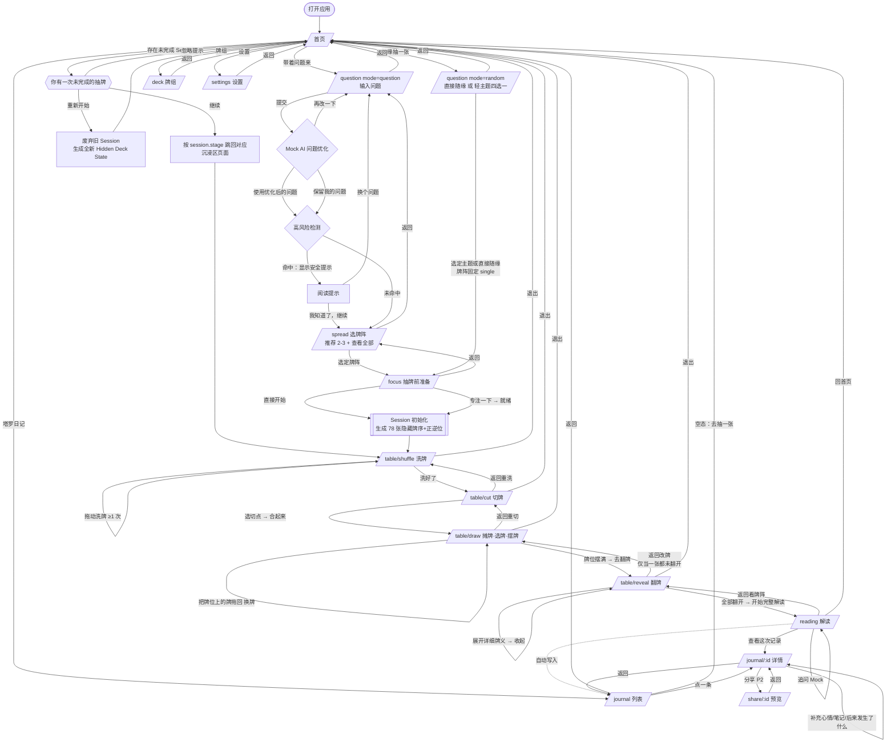

# Arcana — UX / Interaction Spec 用户体验与交互规格（Agent 2 输出）

> 上游：`docs/00-brief.md`（唯一事实来源）→ `docs/01-product-spec.md`（Scope / AC / Guardrails）。
> 本文件只做**体验架构与交互行为**，不含配色、字体、插画（归 Design Agent）。
> 下游：Frontend Agent 直接按本文件实现。所有数值为**规范值**，非建议值。
> 核心原则：**用户不用读说明书也能大致知道怎么操作。**「该你动手了」必须由界面本身表达，文字只是补充。

---

## 1. Sitemap 站点地图

### 1.1 路由表

| 路径 | 页面名 | 进入条件（Guard 守卫） | 退出去向 | 全局导航 | 分区 |
|---|---|---|---|---|---|
| `/` | Home 首页 | 无 | `/question`、`/deck`、`/journal`、`/settings`、恢复 Session | **显示**（弱化次级入口） | 常规区 |
| `/deck` | Deck 牌组 | 无 | 返回来源页 | 显示 | 常规区 |
| `/question?mode=question` | Question 问题输入 | 无 | `/spread`、返回 `/` | 显示 | 常规区 |
| `/question?mode=random` | Random Theme 轻主题选择 | 无 | `/focus`（spread 固定 single）、返回 `/` | 显示 | 常规区 |
| `/spread` | Spread 选牌阵 | `session.question` 非空 或 mode=random | `/focus`、返回 `/question` | 显示 | 常规区 |
| `/focus` | Prepare 抽牌前准备 | `session.spreadId` 非空 | `/table/shuffle`、返回 `/spread` | **隐藏** | **沉浸区** |
| `/table/shuffle` | Shuffle 洗牌 | `stage ≥ prepare` 且 `deck` 已生成 | `/table/cut`、退出→`/` | **隐藏** | **沉浸区** |
| `/table/cut` | Cut 切牌 | `session.shuffled === true` | `/table/draw`、返回 `/table/shuffle`、退出→`/` | **隐藏** | **沉浸区** |
| `/table/draw` | Draw 摊牌+选牌+摆牌 | `session.cut === true` | `/table/reveal`、返回 `/table/cut`、退出→`/` | **隐藏** | **沉浸区** |
| `/table/reveal` | Reveal 翻牌 | `placements.length === spread.cardCount` | `/reading`、返回 `/table/draw`（仅当无牌已翻开）、退出→`/` | **隐藏** | **沉浸区** |
| `/reading` | Reading 解读 | 全部 `revealed === true` | `/journal/:id`、`/`、返回 `/table/reveal` | **半显示**（仅「回首页」+「日记」） | 半沉浸区 |
| `/journal` | Journal 日记列表 | 无 | `/journal/:id`、返回 `/` | 显示 | 常规区 |
| `/journal/:id` | Journal Detail 日记详情 | id 存在，否则 → `/journal` + 空态提示 | `/share/:id`、返回 `/journal` | 显示 | 常规区 |
| `/share/:id` | Share Preview 分享预览（P2） | 同上 | 返回 `/journal/:id` | 显示 | 常规区 |
| `/settings` | Settings 设置 | 无 | 返回 `/` | 显示 | 常规区 |

### 1.2 沉浸区（Immersive Zone）定义

**沉浸区 = `/focus` + `/table/*` 共 5 个路由。**

沉浸区统一规则（Frontend 必须实现为一个共享 Layout）：
1. **不渲染**全局导航栏、Tab Bar、Logo、面包屑。
2. 顶部只保留一条 44px 的 **Immersive Bar 沉浸条**：左侧「退出」图标（24×24，hit area 44×44），中间步骤指示（`洗牌 · 切牌 · 抽牌 · 翻牌` 四点式进度，当前点高亮），右侧留空（不放任何功能）。
3. `overflow: hidden`，`overscroll-behavior: none`，容器高度 `100dvh`，**页面本身永不纵向滚动**（详见 §6.2）。
4. 退出行为：点「退出」→ **不弹确认框**，Session 立即持久化 → 返回 `/`，首页顶部出现 Toast 条「已保存，随时可以继续」，停留 4s。
5. `/reading` 不属于沉浸区，但也不恢复完整导航——只给「回首页」与「查看日记」两个出口。

---

## 2. User Flow 用户流程图

> 每条路径都有回退；每个终点都能回到 `/`。**无死路（No Dead End）** 是 Gate 2 的验收对象。



**无死路自检**：全部 14 个路由均至少有 1 条显式回退边；`/reading` 之后有 3 个出口；所有沉浸区页面均有「退出→首页」这条兜底边；所有空态（日记为空、详情 id 不存在）均给出前进动作。

---

## 3. Page Flow 页面级信息架构

> 基准视口 **375×667（iPhone SE / 8）**。下列「首屏必须放下」为硬约束，超出即视为不合格。
> 每页 **主 CTA（Primary Call To Action 主行动召唤）有且只有一个**。

### 3.1 `/` 首页

- **页面目标**：让用户在 3 秒内做出「带着问题来 / 随缘抽一张」的二选一。
- **元素（按视觉层级）**：
  1. Session 恢复条（条件渲染，顶部，高 64）：「你有一次未完成的抽牌 · 关系牌阵 · 已摆 2/5」+「继续」（主）+「重新开始」（文字按钮）
  2. 品牌区（Arcana + 一句副标题），高 ≈ 140
  3. **主入口卡 A：带着问题来**（高 96，全宽减 40）
  4. 主入口卡 B：随缘抽一张（高 96）
  5. 次级入口行（塔罗日记 / 牌组 / 设置），文字 + 12px 图标，透明度低一档，高 48
- **主 CTA**：「带着问题来」。B 视觉权重次一档（同尺寸，不同强调层级）。
- **可返回**：无（应用根）。
- **空状态**：无 Session 时不渲染恢复条，不留占位空隙。
- **错误/边界**：localStorage 不可用（隐私模式）→ 底部一行提示「当前浏览器无法保存记录，本次抽牌仍可完成」，不阻断。
- **首屏必须放下**：恢复条 + 两个主入口卡 + 次级入口行。**禁止**任何统计数字、连续天数、推荐内容（G-15）。

### 3.2 `/question?mode=question` 问题输入

- **目标**：让用户把心里的问题写出来。
- **元素**：返回按钮 → 引导句「你想问什么？」→ Textarea（最小高 120，自动增高至 200，placeholder 给 1 个示例）→ 字数提示（0/200，仅在 >160 时出现）→ 主 CTA。
- **主 CTA**：「继续」，固定底部，`bottom: 16px + safe-area`，高 52。空输入时 disabled（透明度 0.4，点按抖动 6px 提示，不弹错）。
- **次级操作**：无。
- **优化结果以 Bottom Sheet（底部弹层）呈现**，不跳页：标题「换个说法试试？」+ 优化版问题（可编辑）+ 原问题（灰）+ 两个并列按钮「用优化后的」「保留我的问题」+ 左上角「再改一下」返回编辑。
- **空状态**：Textarea 空 = 初始态。
- **错误**：仅字数上限 200，超出停止输入不报错。
- **首屏**：引导句 + 输入框 + CTA 必须同屏（键盘弹起后 CTA 上浮至键盘上方 8px）。

### 3.3 `/question?mode=random` 轻主题

- **目标**：0 输入进入抽牌。
- **元素**：返回 → 「随缘抽一张」→ 大按钮「直接随缘」（高 72）→ 分隔文字「或者挑一个方向」→ 四个主题 Chip（2×2 网格，每个 高 64）：今日提醒 / 最近状态 / 我需要注意什么 / 给我一个建议。
- **主 CTA**：「直接随缘」。选中 Chip 后**立即前进**（Chip 本身即确认，不需要二次「继续」）。
- **首屏**：全部内容 480px 内放下。

### 3.4 `/spread` 选牌阵

- **目标**：用户自己挑一个牌阵。
- **元素**：返回 → 用户问题回显（1 行省略）→ 「这几个可能适合」→ 推荐牌阵卡 ×2–3（每张高 104：牌阵名 + 牌数徽标 + 一句适合场景 + 牌位缩略示意图）→ 文字按钮「查看全部牌阵」→（展开后）其余牌阵卡。
- **主 CTA**：点牌阵卡本身即选定 → 进入 `/focus`。**不设独立「继续」按钮**（减少一次点击）。
- **次级操作**：查看全部牌阵（原地展开，不跳页，展开后页面可纵向滚动）。
- **空状态**：不存在（永远有推荐）。
- **首屏**：问题回显 + ≥2 张推荐卡 + 「查看全部牌阵」入口。

### 3.5 `/focus` 抽牌前准备（沉浸区入口）

- **目标**：给用户一个「要开始了」的转场，并让他决定是否停一下。
- **元素**：沉浸条（仅退出）→ 用户问题（居中，大字，最多 3 行）→ 牌阵名 + 牌数（小字）→ 主 CTA「直接开始」→ 文字按钮「专注一下」。
- **「专注一下」不跳路由**：原地进入 Focus Mode（专注模式）——背景亮度降至 40%（600ms），其余元素淡出，只留问题文字 + 一行「在心里再想一次你的问题」+ 底部「我准备好了」。**无倒计时、无进度环、无呼吸引导动画**（G：不做 Meditation App）。左上角「退出专注」可回到普通态。
- **主 CTA**：「直接开始」（Focus Mode 下变为「我准备好了」，仍是唯一主 CTA）。
- **可返回**：返回 `/spread`（沉浸条的「退出」在本页语义为「返回上一步」，因为 Session 尚未初始化）。
- **首屏**：全部。

### 3.6 `/table/shuffle` 洗牌

- **目标**：用户亲手把牌弄乱。
- **屏幕预算（667）**：沉浸条 44 / Hint 区 36 / 牌堆舞台 380 / 洗牌状态 32 / CTA 区 60 / 安全区 25 ＝ 577，余量 90 分配为舞台上下留白。
- **元素**：① 沉浸条 ② Hint「滑动牌堆进行洗牌。」③ 牌堆（视觉 200×300，由 18 个牌背实例叠成，代表 78 张）④ 洗牌状态文案「已洗 3 次」（首次操作后才出现）⑤ 主 CTA「洗好了」。
- **主 CTA**：「洗好了」。`shuffleCount === 0` 时 **不渲染**（不是 disabled——按钮根本不存在，从物理上杜绝「跳过洗牌」的观感，满足 AC-02 / G-03）；`shuffleCount ≥ 1` 时淡入（240ms）。
- **次级操作**：无（除沉浸条退出）。
- **可返回**：退出→`/`。
- **空/初始状态**：牌堆做 **Idle Nudge 待机轻推**——每 2.4s 整堆左右摆动 ±3px、时长 900ms，告诉用户「这个东西可以动」。
- **错误/边界**：拖拽位移 < 40px 视为无效，牌堆回弹（弹簧 260ms），不计次，不报错。

### 3.7 `/table/cut` 切牌

- **目标**：用户自己决定从哪里切开。
- **屏幕预算**：沉浸条 44 / Hint 36 / 牌堆侧视舞台 400 / 切点标签 32 / CTA 60 / 安全区 25 ＝ 597。
- **元素**：① 沉浸条 ② Hint「选择一个你想切开的位置。」③ **侧视牌堆**（垂直堆叠，高 300、宽 180，每张牌背露出 3.8px 边）④ **切牌指示线**（贯穿牌堆的一条 2px 亮线 + 右侧 44×44 圆形拖柄，初始位置 = 牌堆中点但**标注为"未选择"**，AC-03 / G-04 要求不得有默认切点语义）⑤ 切点标签「大约第 39 张」⑥ 主 CTA「从这里切开」。
- **主 CTA**：「从这里切开」。**用户未拖动过指示线之前不渲染**（同 §3.6 逻辑，杜绝默认切点）。
- **切开后**：牌堆在切点处分离（上半平移 +64px 上移、下半 -64px 下移，400ms），CTA 变为「合起来」；用户点击后上半移到下半之下（520ms），完成 → 自动进入 `/table/draw`？**否**——完成后 CTA 变为「摊开牌」，仍需用户点。（全程 3 次点击，均为用户主动确认。）
- **可返回**：文字按钮「重新洗牌」（回 `/table/shuffle`，保留已累积的 entropy，不重置 deck）；退出→`/`。
- **边界**：切点被夹在 index 6–72 之间（避免"切了等于没切"），拖柄到达边界时有 8px 阻尼。

### 3.8 `/table/draw` 摊牌 · 选牌 · 摆牌（最复杂页）

- **目标**：让用户从整副牌里挑出属于自己的牌，并亲手放到牌位上。
- **屏幕预算（667，无滚动）**：
  | 区域 | 高度 | 说明 |
  |---|---|---|
  | 沉浸条 | 44 | 含 `2/5` 进度 |
  | **牌阵画布 Board** | 288 | 全部 Drop Zone 按 `SpreadPosition.x/y` 归一化坐标定位；牌位卡槽 64×110 |
  | **手牌区 Hand** | 96 | 拿起的牌停在这里等待摆放；空时显示 Hint 文案 |
  | **扇形区 Fan** | 214 | 屏幕最底部（拇指区），横向滚动 |
  | 底部安全区 | 25 | `env(safe-area-inset-bottom)` |
- **元素层级**：Board（最上，用户目标）→ Hand（中间，当前手上的牌）→ Fan（最下，牌源）。这个**上-中-下 = 目标-手-牌堆**的空间隐喻使拖拽方向天然「由下往上」，符合真人摆牌动作。
- **主 CTA**：**平时不存在**。仅当 `placements.length === spread.cardCount` 时，Fan 区收起（下滑退场 320ms），底部升起「去翻牌」按钮（高 52），Board 同时放大到 1.12 倍。
- **次级操作**：文字按钮「重新切牌」（仅在 `drawn.length === 0 && placements.length === 0` 时显示，避免中途丢失进度）。
- **可返回**：退出→`/`；上述「重新切牌」。
- **空状态**：Hand 区为空时显示当前该做的事（见 §5 引导映射）。
- **边界状态**：
  - 手牌区已有 1 张牌时，再点扇形 → 扇形牌抖动 6px，Hand 区的牌上浮 8px 高亮 200ms（意思是「先把这张放好」）。**不允许手上同时拿 2 张**。
  - 牌位已满 5 张，扇形整体降到 0.45 透明度且不可点。
  - 拖拽释放时不在任何 Drop Zone 有效范围 → 牌弹回 Hand 区（弹簧 280ms），不报错。

### 3.9 `/table/reveal` 翻牌

- **目标**：用户逐张亲手翻开，并读到第一层牌义。
- **屏幕预算**：沉浸条 44 / Board 470（牌位卡槽放大到 88×150）/ 底部区 128（初始为进度提示「已翻开 1/5」；全部翻开后变为主 CTA）/ 安全区 25。
- **元素**：① 沉浸条 ② Board（每个牌位下方一直显示牌位名，如「阻碍」）③ 未翻开牌：牌背 + Idle Nudge ④ 已翻开牌：牌面 + 正/逆位角标 ⑤ **牌义 Sheet（底部弹层）**：翻开某张后从底部升起，高 180，含「牌名 — 正/逆位｜关键词 · 关键词 · 关键词」+「查看详细牌义」；上拉可展开到 480（内部滚动），下拉关闭。
- **主 CTA**：全部翻开前无 CTA；全部翻开后出现「开始完整解读」（AC-10：不自动跳转、不自动弹出）。
- **次级操作**：点已翻开的牌 → 重新打开它的牌义 Sheet。
- **可返回**：`/table/draw`（仅当 `revealed` 全为 false）；退出→`/`。一旦翻开第一张，「返回改牌」入口消失（G-09）。
- **边界**：翻开的牌被拖动 → 不移动，牌位边框做一次 120ms 的「锁定」微光收缩，**不弹任何提示框**（AC-06 / G-10）。

### 3.10 `/reading` 解读

- **目标**：先给结论，再按需展开。
- **元素**：① 顶部条（「回首页」+「查看日记」）② 牌阵缩略条（横向 5 张小牌 40×68，可点回看牌义）③ **核心结论 1–2 段**（默认全展开）④ 折叠区：每张牌分析 / 牌位含义 / 卡牌关系 / 综合趋势 / 值得注意 / 行动方向（全部默认折叠，Accordion 手风琴）⑤ 安全提示条（命中时）⑥ 底部追问输入框（固定，高 56）。
- **主 CTA**：无强 CTA（阅读页）。追问发送按钮为唯一操作按钮。
- **可返回**：`/table/reveal`（缩略条点击）、`/`、`/journal/:id`。
- **空/错误**：Mock 生成中显示 3 行骨架 800ms；追问超出 Context 范围时 Mock 回一句拉回本次抽牌的话（AC-12）。

### 3.11 次要页面（紧凑表）

| 页面 | 目标 | 主 CTA | 空状态 | 关键约束 |
|---|---|---|---|---|
| `/journal` | 回顾过去的抽牌 | 无（列表项即操作） | 「还没有记录 · 去抽一张」按钮 → `/` | 列表项含日期 / 问题（1 行）/ 牌阵名 / 卡牌缩略 ×N（28×48）/ 核心结论 1 行 |
| `/journal/:id` | 看完整记录 + 补充自己的话 | 无 | id 不存在 → 提示 + 「回到日记列表」 | 三个可编辑块（心情 / 我的笔记 / 后来发生了什么），**失焦即存**，不放「保存」按钮（G-23 精神一致） |
| `/share/:id`（P2） | 生成分享预览 | 「复制文案」 | — | 默认只勾选卡牌 / 正逆位 / 牌阵 / 核心结论；原问题开关默认 **关**（AC-14 / G-24） |
| `/deck` | 确认我在用哪副牌 | 「就用这副」→ 返回 | — | 展示牌背 + 6–10 张代表牌 + 说明。默认已选中 |
| `/settings` | 四个开关 | 无 | — | 新手引导 / 音效 / 震动 / 摊牌模式（扇形 · 自由桌面【即将推出，禁用态】） |

---

## 4. Interaction Flow 核心交互说明

> 通用规则（七个环节全部适用）：
> - **G-A 进入下一步必须用户主动点击确认，任何环节都不得因动画结束而自动跳转。**
> - **G-B「该我动手了」的三重信号**：① **Affordance Motion 可操作性微动**（对象自身轻微运动，最强信号）② **Hint 文案**（首次明显，之后弱化）③ **Idle Escalation 静默升级**（进入步骤后 3.5s 无操作，微动幅度 ×1.6，Hint 淡入）。
> - **G-C 触觉与音效**：均遵循 Settings 开关；Haptic 一律使用 `navigator.vibrate` 的 8–18ms 短脉冲，**禁止 >30ms 或连续脉冲**（G-08）。

### 4.1 洗牌 Shuffle

- **用户手势**：在牌堆上**水平拖动**（左或右均可），可重复任意次数。
- **有效判定**：单次 `pointerdown → pointerup` 期间 `|dx| ≥ 40px` 记为 1 次有效洗牌；`|dx| < 40px` 回弹不计数。
- **系统反馈**：
  - 视觉：拖动中牌堆按 `dx` 分裂为 3 个子堆（偏移 = `dx × [1.0, 0.55, 0.25]`，最大 ±64px）并各自旋转 `dx/24` 度（上限 ±8°）；`pointerup` 后 420ms 弹簧归位并**重新叠成新顺序**（顶部牌换成另一个牌背实例，用户能看出「不是原来那堆」）。
  - 触觉：每次有效洗牌结束 12ms。
  - 听觉：纸牌摩擦声，音量 0.25，随 `|dx|` 线性映射。
- **状态机**：`idle → dragging → settling → shuffled(n)`；`shuffled(n)` 上继续拖动回到 `dragging`（n 累加）。
- **完成信号**：牌堆归位后，屏幕出现/更新「已洗 3 次」，且**主 CTA「洗好了」首次淡入**。这就是「这一步可以结束了」的唯一信号。
- **进入下一步**：点「洗好了」。
- **该我动手了**：Idle Nudge（每 2.4s ±3px 摆动）+ Hint 文案。

### 4.2 切牌 Cut

- **用户手势**：**垂直拖动**牌堆右侧的圆形拖柄（44×44），或直接在牌堆任意高度 **Tap**（拖柄跳到该处，同样算"用户选择"）。
- **系统反馈**：
  - 视觉：拖柄跟手；切牌线所在位置牌堆出现 4px 缝隙预览；实时更新标签「大约第 N 张」。
  - 触觉：每跨过 5 张 6ms 微脉冲（Tick 刻度感）。
  - 听觉：无（避免噪音）。
- **状态机**：`unset → picking → picked(pos) → splitting → split → merging → done`。
  - `unset`：CTA 不存在，拖柄做 Idle Nudge（上下 ±4px）。
  - `picked` → 用户点「从这里切开」→ `splitting`(400ms) → `split`。
  - `split` → 用户点「合起来」→ `merging`(520ms) → `done`。
  - `done` → CTA 变「摊开牌」。
- **完成信号**：`split` 时牌堆**肉眼分成上下两半并留出 128px 间隙**（简报 §9「看到牌堆分成两部分」）；`done` 时牌堆重新成为一堆且顶部牌背换了一张。
- **进入下一步**：点「摊开牌」。
- **该我动手了**：拖柄上下微动 + Hint「选择一个你想切开的位置。」

### 4.3 摊牌 Fan Spread

- **用户手势**：在 Fan 区**横向滑动**浏览（惯性滚动 + 边界橡皮筋 48px）。
- **规格**：78 个牌背实例；单卡 76×130；相邻露出宽度 22px；虚拟内容宽 `77×22 + 76 = 1770px`；初始滚动位置 = 中点（`x = (1770-375)/2`），并在进入后播放一次 **Fan Reveal 展开动画**：78 张从中心逐张展开（stagger 6ms，总 ≈ 520ms），告诉用户「这是一整副牌」。
- **系统反馈**：滑动中处于视口中心 ±40px 的牌上浮 6px、亮度 +8%（Focus Card 焦点牌，纯视觉，**不代表选中**）。
- **状态机**：`entering → browsing ↔ flinging`。
- **完成信号**：无「完成」概念——摊牌不是一个需要确认的步骤，它与选牌合并在同一页面。
- **该我动手了**：展开动画结束后，扇形整体做一次 240ms 的水平「呼吸」位移（+8px → 0），暗示可横滑。

### 4.4 选牌 Select

- **用户手势（二选一，都支持）**：
  - **Tap** 某张牌背 → 拿起
  - **向上滑动** 某张牌背 ≥ 32px → 拿起（更接近"抽出来"的真实动作）
- **手势判定（与横滑冲突的解法见 §6.3）**：`pointerdown` 后累计位移首次超过 **12px** 时锁定主轴；`|dx| > |dy|` → 横滑浏览；`|dy| > |dx| 且 dy < 0` → 抽牌；若 `pointerup` 时总位移 < 8px 且时长 < 400ms → Tap 抽牌。
- **系统反馈**：
  - 视觉：该牌从扇形中沿上滑方向抽离（280ms，ease-out），飞入 Hand 区居中位置并轻微落定（弹簧 220ms）；原位置的空隙由相邻牌在 320ms 内合拢。
  - 触觉：12ms。
  - 听觉：抽牌声，音量 0.3。
- **状态机**：`fan.idle → picking → inHand`；`inHand` 时扇形进入 `locked`（点击只抖动，不拿起）。
- **完成信号**：牌**离开了扇形、出现在 Hand 区**——位置变化本身即完成信号，无需文案。
- **进入下一步**：无按钮，Hand 区有牌即自然进入摆牌。

### 4.5 摆牌 Place

- **用户手势**：**从 Hand 区把牌向上拖到 Board 的某个空 Drop Zone 并释放**。
- **判定与反馈**：
  - 拖拽启动阈值：位移 ≥ 6px（Hand 区不需要方向判定，任何方向都是拖拽）。
  - **吸附判定半径 56px**（拖拽牌中心 → Drop Zone 中心）。进入范围内：Drop Zone 边框透明度 0.35 → 0.75，`scale 1.0 → 1.06`，卡牌本身**不位移**（不是磁吸，用户仍需自己拖到位）。
  - 释放：在半径内 → 牌以 240ms 落入牌位（位移距离 ≤ 56px，看起来是"放下"而不是"飞过去"，符合 G-06）；不在半径内 → 弹回 Hand 区。
  - 触觉：进入吸附范围 8ms；成功落位 14ms。
  - 听觉：放牌声，音量 0.35。
- **状态机**：`hand.holding → dragging → (hovering:zoneId) → placed | returned`。
- **Drop Zone 状态**：`empty`（虚线描边 + 牌位名 + Idle 呼吸 2.8s 一周期）→ `hovering`（实线 + 放大）→ `filled`（牌背 + 牌位名）→ `locked`（已翻开）。
- **完成信号**：Drop Zone 从虚线变实心并显示牌背，沉浸条进度 `2/5 → 3/5`。
- **多牌阵顺序**：**用户自由决定放哪个牌位、什么顺序**，系统不高亮"下一个应该放的位置"（那属于替用户决定）。仅在 Hand 区有牌时，所有空 Drop Zone 一起呼吸。
- **进入下一步**：摆满后出现「去翻牌」，用户点击。

### 4.6 换牌 Swap

- **用户手势**：把**未翻开**的、已在牌位上的牌**向下拖出**牌位（阈值 24px）。
- **系统反馈**：拖出即牌位恢复 `empty`；释放时——落在 Hand 区 → 回到手牌可重新摆；落在 Fan 区 → **牌放回牌堆**（`drawn` 中移除，用户可重新选一张不同位置的牌）；落在其他地方 → 回 Hand 区。
- **全程不弹 Confirm Dialog**（AC-06 / G-10）。状态自然表达：牌位空了 = 可以换了。
- **已翻开的牌**：`pointerdown` 后不产生任何位移，牌位边框做 120ms 收缩微光，Haptic 8ms 一次。无文字警告。
- **状态机**：`placed → liftedBack → (hand | fan | placed)`。

### 4.7 翻牌 Reveal

- **用户手势（二选一）**：**Tap** 牌位上的牌；或在牌上**向上滑 ≥ 32px**。
- **系统反馈**：
  - 视觉：Y 轴 3D 翻转，总时长 **520ms**，分两段——0–260ms `cubic-bezier(.32,0,.67,0)` 加速抬起并 `scale 1.0→1.08`；260–520ms 减速落下 `scale 1.08→1.0`。翻转过半（260ms）时才切换到牌面（保证不提前泄露，AC-07）。逆位牌在数据层即 `rotate(180deg)`，翻开后直接呈现，**不做二次旋转动画**（避免"系统在决定方向"的观感）。
  - 极轻微 Glow：翻转结束时牌缘 0.18 透明度光晕，600ms 淡出。**禁止**粒子、闪光、缩放弹跳、屏幕震动（G-08）。
  - 触觉：翻转起始 10ms，落定 14ms。
  - 听觉：翻牌声，音量 0.3。
- **状态机**：`facedown → flipping → faceup(locked)`。不可逆。
- **完成信号**：牌面出现 + 底部牌义 Sheet 升起（延迟 200ms，等翻转动画收尾）+ 进度「已翻开 3/5」。
- **进入下一步**：Sheet 内**没有**「下一张」按钮——用户自己点下一张未翻开的牌。全部翻完后，Sheet 自动降回 180px 高度，底部出现「开始完整解读」（AC-10）。
- **该我动手了**：未翻开的牌做 Idle Nudge（每 3.2s 上下 ±2px，stagger 错开，避免整齐划一像动画播放）。

---

## 5. New User Guidance 新手引导策略

### 5.1 策略总则

- **不做独立教学页、不做多页 Onboarding、不做遮罩式 Coach Mark（会打断操作）**。
- 引导 = **一行 Hint 文案 + 对象自身的可操作性微动**，与操作区共存，永不覆盖可操作元素。
- 判定依据：`localStorage.arcana.hasCompletedFirstDraw`（布尔）+ `settings.guidance`（用户可在设置里重开）。

### 5.2 两种呈现档位

| | **第一次（Guided 明显）** | **第二次以后（Faded 弱化）** |
|---|---|---|
| 出现时机 | 进入步骤后 **600ms** 自动淡入 | 进入步骤后 **3.5s 无有效操作** 才淡入 |
| 视觉 | 独立 Hint 条，高 36，透明度 1.0，字号 15，居中，带 2.4s 呼吸 | 无底衬的纯文字，透明度 0.55，字号 13，不呼吸 |
| 微动幅度 | Idle Nudge 100% | Idle Nudge 60% |
| 消失条件 | 该步骤**第一次有效操作**触发时淡出 200ms，本次流程内不再出现 | 同左 |
| 额外 | 每步 Hint 只出现一次；用户回退重来时**不重复播放** | — |

**永远不做**：不在任何时候阻断点击、不使用半透明黑遮罩、不使用「下一步 →」教学按钮、不用箭头指向手指图标。

### 5.3 简报 §19 五句文案的确切位置

| 文案 | 路由 | 屏幕位置 | 触发 | 消失 |
|---|---|---|---|---|
| 「滑动牌堆进行洗牌。」 | `/table/shuffle` | 沉浸条下方 12px，牌堆舞台上方（y ≈ 56–92） | 进入后 600ms | 首次 `|dx| ≥ 40px` 有效洗牌 |
| 「选择一个你想切开的位置。」 | `/table/cut` | 同上位置（y ≈ 56–92） | 进入后 600ms | 拖柄首次被拖动 / 牌堆首次被 Tap |
| 「慢慢浏览，选择你想拿起的牌。」 | `/table/draw` | **Hand 区内**（y ≈ 332–428，居中），Hand 为空时占位 | Fan 展开动画结束后 600ms | 首次成功拿起一张牌 |
| 「把它放到对应牌位。」 | `/table/draw` | **同一 Hand 区**，替换上一句，位于手牌右侧（Hand 有牌时布局为 牌 + 文案） | 牌进入 Hand 后 300ms | 首次成功落位 |
| 「准备好后，翻开它。」 | `/table/reveal` | Board 下方、进度文案位置（y ≈ 514–550） | 进入后 600ms | 首次翻开任意一张 |

> 「慢慢浏览…」与「把它放到对应牌位。」共用 Hand 区同一块空间，是刻意的：**这块区域始终回答"现在轮到我做什么"**，用户只需要盯一个地方。

### 5.4 非 §19 的必要微文案（不属于教程，属于状态标签）

- `/table/shuffle`：「已洗 N 次」
- `/table/cut`：「大约第 N 张」
- `/table/draw`：沉浸条 `3/5`
- `/table/reveal`：「已翻开 3/5」
这些**两种档位下都始终显示**，因为它们是状态而非引导。

---

## 6. 移动端交互注意事项

### 6.1 拇指热区与安全区

- 基准 375×667，右手单手握持。**Easy Zone 舒适区 = 距底边 0–190px**；**Stretch Zone = 190–430px**；**Hard Zone = 430px 以上**。
- **规则**：所有需要**反复操作**的控件（扇形横滑、Hand 区、主 CTA）必须落在 Easy Zone；**一次性操作**（退出、返回）允许在 Hard Zone（顶部）。
  - 这正是 §3.8 把 Fan 放最底部、Board 放最上方的原因：Board 是**目标**（看得见即可），Fan 是**反复操作对象**（必须够得着）。
- 主 CTA 高度 **52**，宽度 = 屏宽 − 40，`margin-bottom: max(16px, env(safe-area-inset-bottom) + 8px)`。
- 沉浸条 `padding-top: max(8px, env(safe-area-inset-top))`；沉浸区根容器高 `100dvh`（非 `100vh`，规避 iOS 地址栏抖动）。
- Home Indicator 区域（底部 34px）内**不放任何可拖拽元素**——iOS 会把上滑吞掉。Fan 区底边距屏幕底部保留 **25px** 净空。

### 6.2 手势冲突：这是本产品最高风险点

**冲突三方**：① 页面纵向滚动 ② 扇形横向滑动 ③ 卡牌拖拽（选牌上滑 / 摆牌任意方向）。

**解法（四道防线，必须全部实现）**：

**防线 1 — 消灭页面滚动。**
沉浸区根容器 `position: fixed; inset: 0; height: 100dvh; overflow: hidden; overscroll-behavior: none; touch-action: none;`。`/table/*` 四页**没有任何页面级纵向滚动**，所有内容按 §3 的高度预算精确排布。这一步就消灭了冲突的 ①。
唯一例外：`/table/reveal` 的牌义 Sheet 展开后内部可滚（`touch-action: pan-y`，且 Sheet 是覆盖层，不与 Board 同时可交互）。

**防线 2 — 空间分离（Zone Separation）。**
横滑只在 **Fan 区（底部 214px）**发生；拖拽只从 **Hand 区（96px）** 或 **Board（288px）** 发起。三块区域**互不重叠**，同一坐标永远只归属一种手势。这是最根本的解法——大部分冲突不是靠算法解决的，是靠布局避免的。

**防线 3 — 轴锁定（Axis Lock），用于 Fan 区内部的横滑 vs 上滑抽牌。**
```
pointerdown → 记录起点，intent = 'undecided'
pointermove → 累计位移 d
  if (|d| < 12px) 不做任何响应（既不滚也不拖）
  else if intent === 'undecided':
        intent = (|dx| >= |dy|) ? 'scroll' : (dy < 0 ? 'pick' : 'scroll')
        // 向下滑一律判为 scroll，避免误抽
  锁定 intent 直到 pointerup，中途不再改判
pointerup → 若 |d| < 8px 且 duration < 400ms → tap（抽牌）
```
`|d| < 12px` 的**死区（Dead Zone）**是关键：手指刚落下的抖动不会触发任何事。

**防线 4 — Pointer Events 统一 + 显式 capture。**
全部交互用 Pointer Events（覆盖 touch/mouse/pen），在 `pointerdown` 时 `setPointerCapture`，保证拖拽过程中手指移出元素也不丢事件。Fan 区 `touch-action: pan-x`（把纵向交给我们自己处理），Hand/Board 区 `touch-action: none`。**不使用任何 hover-only 交互**（G-20）。

### 6.3 误触防范

| 风险 | 解法 |
|---|---|
| 洗牌时误触「洗好了」 | CTA 距牌堆舞台底边 ≥ 48px；牌堆拖拽结束后 200ms 内 CTA 不响应点击（Post-Gesture Cooldown 手势后冷却） |
| 摊牌横滑时误抽牌 | 12px 死区 + 轴锁定（§6.2 防线 3）；且 fling 惯性滚动期间**禁用抽牌**，需先 tap 停下 |
| 拖拽中误触退出按钮 | 任一拖拽进行中，沉浸条整体 `pointer-events: none` 且透明度降到 0.4 |
| 翻牌时误连翻两张 | 一张翻转动画（520ms）期间，其余牌 `pointer-events: none` |
| 换牌时把牌拖丢 | 无效释放一律弹回 Hand 区，永不删除 |
| 快速连点主 CTA 导致双跳转 | 所有导航型 CTA 加 400ms 节流 |

### 6.4 卡牌最小可点面积

- **绝对下限 44×44 CSS px**（含透明 hit-slop）。
- 扇形牌：视觉露出 22px 宽，**hit area 用一个 44×130 的透明层**居中覆盖在每张牌的露出区上（相邻 hit area 会重叠，命中取 z-index 最高者 = 视觉上在最上层那张，与用户预期一致）。
- Drop Zone：64×110（`/table/draw`）/ 88×150（`/table/reveal`），均远超下限。
- 切牌拖柄：44×44。
- 沉浸条退出按钮：图标 24×24，hit area 44×44。
- 相邻可点元素**中心间距 ≥ 48px**（Fan 区因是同类连续元素，例外）。

### 6.5 桌面端降级（可用即可）

- 视口 ≥ 768px：沉浸区内容整体居中在 **420px 宽的列**内，其余留白，布局与移动端完全一致（不做桌面专属布局）。
- Pointer Events 天然支持鼠标；扇形支持滚轮横滑（`deltaY → scrollLeft`）；拖拽同样用 Pointer。
- **不新增任何 hover 才能触发的功能**；hover 只允许做纯装饰的亮度变化。

---

## 7. 信息密度与按钮数量约束

**沉浸区硬约束（Frontend 自查表）**：

| 页面 | 最多可见按钮数 | 允许的按钮 | 文字总量上限 |
|---|---|---|---|
| `/focus` | **3** | 退出 / 直接开始 / 专注一下 | 问题 + 1 行提示 |
| `/table/shuffle` | **2** | 退出 / 洗好了（未洗时仅 1） | Hint 1 行 + 状态 1 行 |
| `/table/cut` | **3** | 退出 / 主 CTA / 重新洗牌 | Hint 1 行 + 状态 1 行 |
| `/table/draw` | **2** | 退出 / 去翻牌（摆满前仅 1，或 1+重新切牌） | Hint 1 行 + 进度 |
| `/table/reveal` | **2** | 退出 / 开始完整解读（+ Sheet 内「查看详细牌义」1 个） | 关键词层 ≤ 40 字 |

**避免破坏沉浸感的六条规则**：
1. **一页一个主 CTA**，且主 CTA 只在「可以进入下一步」时才存在（不用 disabled 灰按钮占位——灰按钮会让用户一直盯着它想怎么点亮）。
2. 所有非必要控件（设置、帮助、分享、音效开关）**不出现在沉浸区**。要改设置就退出去改。
3. **禁止 Modal Dialog**（除 `/question` 的问题优化 Bottom Sheet 与 `/table/reveal` 的牌义 Sheet，二者都是内容层不是打断层）。
4. **禁止 Toast 堆叠**：沉浸区同一时刻最多 1 条 Toast，时长 2.4s。
5. 文案一律**祈使句 + 不超过 12 字**；不写「点击下方按钮以继续」这类说明书语言。
6. **禁止进度百分比、步骤 "3/6"、时间估计**——只用四点式进度点（洗·切·抽·翻），它是空间定位而非任务清单。

---

## 8. UX 风险清单（预判用户最容易卡住的 5 个点）

### R-01 洗牌页「我不知道要洗到什么时候」
- **表现**：用户洗了 1–2 次就停下来盯着屏幕，不确定够不够；或反复洗十几次不敢进入下一步。
- **根因**：现实中洗牌的结束由自己感觉决定，线上缺少"够了"的实体反馈。
- **解法**：① 首次有效洗牌后「洗好了」CTA 才出现，出现本身就是"你已经可以继续了"的许可。② 状态文案「已洗 N 次」给出可数的进度感。③ 第 3 次洗牌后，CTA 做一次 400ms 的轻微亮度提升（**只做一次**，不重复催促）。④ **不设推荐次数、不设最少次数**（否则变成任务）。

### R-02 摊牌页「78 张我从哪看起 / 我怎么知道要往下拖」
- **表现**：用户在扇形上横滑很久，不知道 Tap 就能拿起；或拿起后不知道要拖到上面。
- **根因**：拿起与摆放是两个动作，但视觉上没有明确的中转。
- **解法**：① **Hand 区常驻**，它是"当前轮到我做什么"的唯一注视点，空时写「慢慢浏览，选择你想拿起的牌。」，有牌时写「把它放到对应牌位。」（§5.3）。② 牌进入 Hand 时，所有空 Drop Zone **同时开始呼吸**，形成"从下往上"的视觉引力。③ 支持 Tap 和上滑两种拿起方式，用户任一直觉都能成功。

### R-03 摆牌拖拽「拖不准 / 一直弹回来」
- **表现**：反复拖动却总是弹回 Hand 区，产生挫败。
- **根因**：Drop Zone 判定过严，或手指遮挡了牌位。
- **解法**：① 吸附判定半径 **56px**（远大于卡牌宽度的一半），且判定基于**拖拽牌中心**而非手指位置。② 拖拽时卡牌相对手指**上移 40px**（Finger Offset 手指偏移），保证牌和目标牌位都不被手指遮住。③ 连续 2 次弹回后，空 Drop Zone 的呼吸幅度提高到 1.5 倍，持续 3s。④ 弹回**永远不报错、不响提示音**，只是回到原位。

### R-04 翻牌页「以为翻完就结束了 / 找不到解读」
- **表现**：全部翻完后停在牌阵页反复点牌，不知道还有 AI 解读；或反之，翻完第一张就期待解读自动出现。
- **根因**：AC-10 要求不自动弹出解读，这与用户在其他 App 养成的"自动推进"预期相反。
- **解法**：① 全部翻开的瞬间，牌义 Sheet **主动降回 180px** 并让整个牌阵完整可见 600ms（"先看看你的牌"），随后底部升起「开始完整解读」（滑入 320ms）。② 该 CTA 是全屏唯一的高对比元素。③ 进度文案在翻完时改为「5 张都翻开了」，语义上收尾。④ **不催促**：用户可以一直停留看牌义，CTA 不闪不跳。

### R-05 中断恢复「回来后不知道自己抽到哪一步了」
- **表现**：几小时后重开，看到首页恢复条但不敢点，怕丢掉进度；或恢复后落到某一页却不记得上下文。
- **根因**：跨会话的上下文丢失。
- **解法**：① 首页恢复条写清楚**三段信息**：问题（1 行省略）+ 牌阵名 + 进度（「已摆 2/5」），而不是笼统的"未完成的抽牌"。② 「继续」按主，「重新开始」是文字按钮（低权重，因为它会销毁 Hidden Deck State）。③ 恢复后落地页顶部出现 2.4s Toast：「回到了：摆牌」。④ 恢复后**第一次**的引导档位强制用 Faded（弱化）而非 Guided，避免熟练用户被重新教一遍；但若该步骤在首次流程中还没触发过 Hint，仍以 Guided 显示一次。⑤ 「重新开始」不弹确认框，改为执行后出现 4s 的「已重新开始 · 撤销」Toast（唯一允许撤销的破坏性操作）。

### 补充：R-06 高风险问题提示被当作报错（次级风险）
安全提示以**信息条**呈现（非红色、非弹窗），文案后直接跟两个平级按钮「我知道了，继续」「换个问题」，绝不阻断（AC-11 / G-14）。

---

## 9. Gate 2 (UX) 自检结论

- **无死路**：14 个路由全部具备回退边；沉浸区 5 页均有「退出→首页 + 自动保存」兜底；3 个空状态（日记为空、日记 id 不存在、localStorage 不可用）均给出前进动作。
- **决定权未被侵蚀**：洗/切/摊/选/摆/翻六步的下一步全部由**用户点击**触发，无任何自动跳转、无一键洗牌、无默认切点、无自动飞入、无全部翻开、无自动弹出解读。
- **可操作性靠界面表达**：每一步的「该我动手了」都由对象自身微动 + 空间位置（Fan 在拇指区、Hand 是注视点、Board 是目标）承担，文案仅为补充，符合"不用读说明书"。
- **移动端**：全部沉浸区页面在 375×667 内零滚动排布；手势冲突用「消灭滚动 + 空间分离 + 轴锁定 + Pointer Capture」四道防线解决；最小可点面积 44×44 全覆盖。
- **未扩大 Scope**：未新增页面、牌阵、牌组、功能；Share 保持 P2；Free Table Mode 仅在 `/settings` 以禁用态占位。
